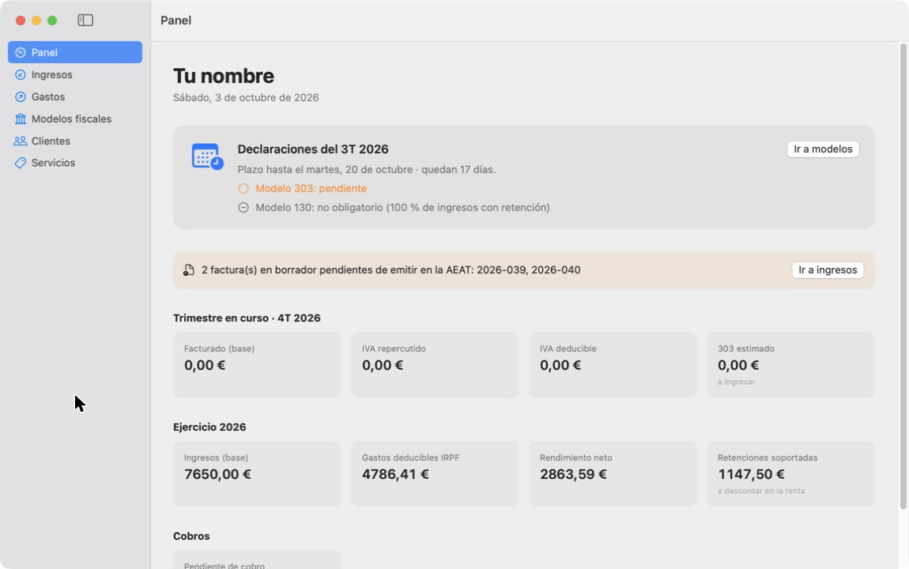
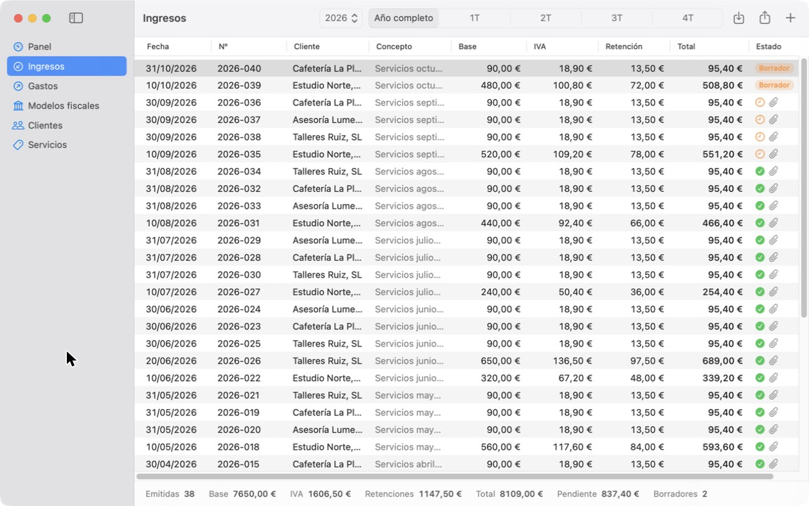
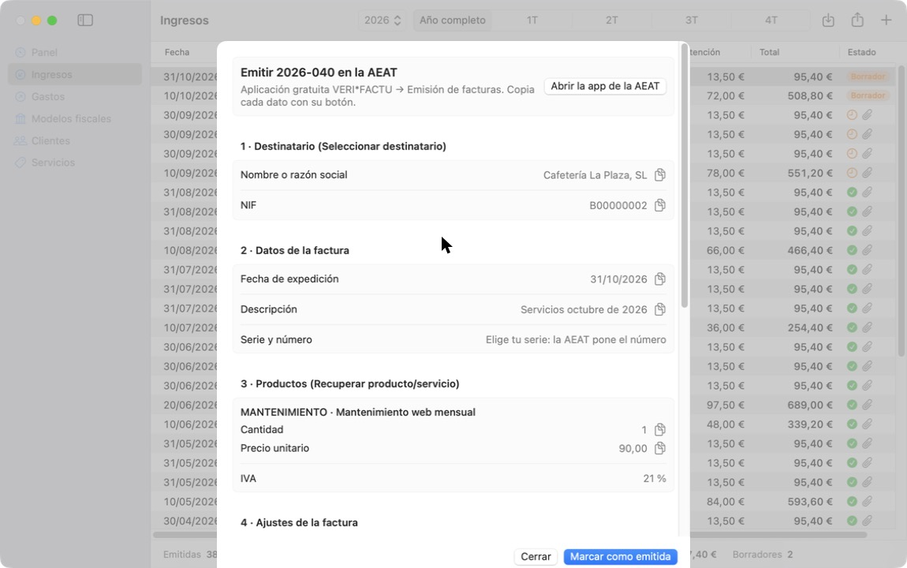
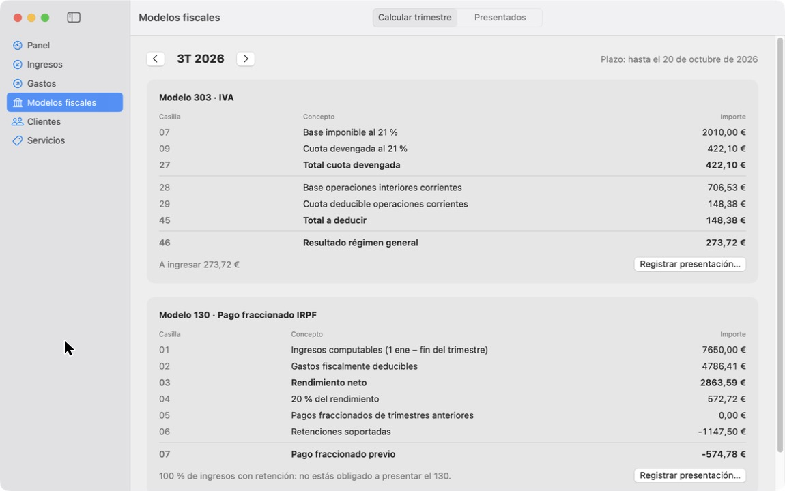
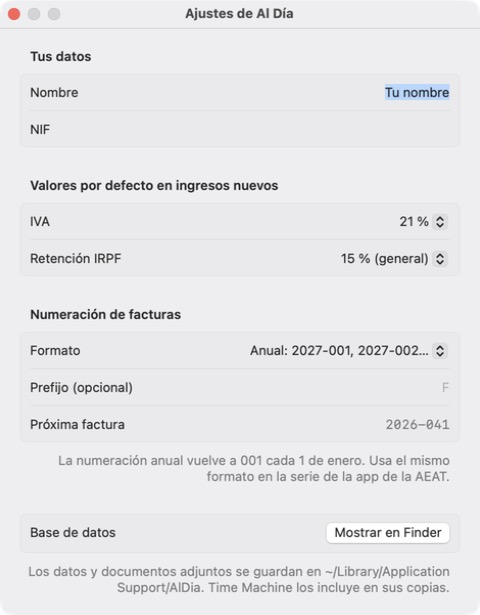

# Al Día

**Contabilidad sencilla para autónomos en España: una app nativa para Mac.**
Mantente al día con Hacienda: prepara tus facturas, apunta los gastos deducibles y ten calculados tus modelos trimestrales (303 / 130), casilla por casilla.

[Read in English](README.md) · macOS 15+ · Swift 6 · SwiftUI + SwiftData · [MIT](LICENSE)



## ¿Para quién es?

Para cualquier autónomo en España que quiera tener sus números en orden sin pagar un programa de contabilidad completo. Está pensada para seguir siendo sencilla tanto si haces una factura al mes como treinta, a un cliente o a diez.

Al Día **no** es un sistema de facturación VeriFactu y no envía nada a Hacienda. Las facturas oficiales se emiten con la **aplicación gratuita VERI\*FACTU de la AEAT**; Al Día las prepara, las controla y hace las cuentas fiscales a su alrededor.

## Qué hace

- **Panel** con el próximo plazo, qué modelos están presentados, los borradores pendientes y las cifras del trimestre y del año.
- **Ingresos**: facturas con líneas, IVA y retención de IRPF, estado de cobro y PDF adjunto.
  - Los **borradores** preparados en Al Día no cuentan para impuestos hasta que los marcas como emitidos.
  - **Ficha de emisión**: cada dato que pide la app de la AEAT, en el mismo orden, con botón de copiar.
  - **Importación de PDF** de las facturas que ya tienes (hechas con una plantilla de hoja de cálculo), con revisión previa.
  - **Numeración anual** (`2027-001`, `2027-002`…, con prefijo opcional) que vuelve a empezar cada 1 de enero y nunca se repite, hagas las facturas que hagas al mes.
- **Gastos**: IVA deducible y gasto de IRPF calculados en cada compra, con valores habituales por categoría (50 % de IVA en vehículo de uso mixto, sin IVA en la cuota de autónomos…).
  - **Importa un ticket o factura** desde su PDF o una foto (o arrástralo a la lista): proveedor, NIF, número, fecha, base, IVA y total se leen con el reconocimiento de texto del propio Mac (Apple Vision) y quedan rellenos para que los revises. También comprueba si la factura lleva tu NIF, es decir, si su IVA es deducible.
- **Modelos fiscales**: borrador del **303** (IVA) y del **130** (pago fraccionado de IRPF) con sus casillas; detecta cuándo no tienes que presentar el 130 (≥ 70 % de ingresos con retención); registra lo presentado con su justificante y arrastra el IVA a compensar.
- **Clientes y servicios**, exportables en el formato de texto exacto que importa la app de la AEAT.
- **Exportación CSV** de los libros de ingresos y gastos para tu gestor.
- Interfaz en **castellano e inglés** (según el idioma del Mac).
- **Local y privada**: todo se queda en tu Mac, sin cuentas ni conexiones a internet.

| Ingresos | Emitir en la AEAT | Modelos fiscales | Ajustes |
|---|---|---|---|
|  |  |  |  |

## Cómo encaja con VeriFactu

Desde el **1 de julio de 2027** todo autónomo que facture con un programa tendrá que usar un sistema que cumpla VeriFactu ([RD 1007/2023](https://www.boe.es/buscar/act.php?id=BOE-A-2023-24840), plazo fijado por el RDL 15/2025). Programar ese software convierte a quien lo hace en su «productor» ante Hacienda, así que Al Día se queda deliberadamente en el lado seguro:

1. **Preparas** la factura en Al Día (borrador).
2. **La emites** en la [aplicación gratuita VERI\*FACTU](https://sede.agenciatributaria.gob.es/Sede/procedimientoini/IZ86.shtml) copiando los datos de la ficha.
3. **La marcas como emitida** en Al Día con el número oficial y el PDF (con su código QR).

Antes de la primera factura, exporta tus clientes y servicios desde Al Día e impórtalos en la app de la AEAT (*Otros servicios → Clientes / Productos → Importar*): así emitir es solo elegirlos.

## Instalación

Todavía no hay una descarga notarizada; se compila desde el código con un solo comando:

```bash
git clone https://github.com/juanitreque/al-dia.git
cd al-dia
scripts/build-app.sh --install
```

Necesitas macOS 15 o posterior y Xcode 16 o posterior (hace falta el toolchain de Xcode para las macros de SwiftData y el catálogo de textos).

La app queda en la carpeta Aplicaciones (`/Applications`) como **Al Día.app**. Está firmada sin certificado de desarrollador, así que la primera vez macOS puede decir que no puede verificarla: clic derecho sobre la app → **Abrir** → **Abrir**.

## Tus datos

Todo se guarda en `~/Library/Application Support/AlDia/` (una base de datos SwiftData/SQLite y los PDF adjuntos) y entra en las copias de Time Machine. *Ajustes → Mostrar en Finder* abre la carpeta. Nada sale de tu Mac.

## Desarrollo

```bash
swift test                        # tests de la lógica fiscal (AlDiaCore)
swift run AlDia --demo            # arranca con una base temporal llena de datos de ejemplo
scripts/sync-strings.sh           # extrae los textos a packaging/Localizable.xcstrings
swift scripts/make-icon.swift     # regenera el icono
```

```
Sources/
  AlDiaCore/   lógica pura: trimestres, plazos, modelos 303/130, numeración, lectores de facturas y tickets, formatos AEAT
  AlDia/       app SwiftUI: modelos SwiftData, vistas, datos de demostración
Tests/         tests (Swift Testing) de AlDiaCore
packaging/     Info.plist, icono y Localizable.xcstrings (castellano de origen, traducción al inglés)
scripts/       compilación, sincronización de textos e icono
```

El castellano es el idioma de origen del código y del catálogo de textos; el inglés está en `packaging/Localizable.xcstrings` (se edita con Xcode). Las contribuciones son bienvenidas, sobre todo correcciones de la lógica fiscal, que deben venir con su test.

## Limitaciones

- Solo régimen general de IVA y estimación directa en IRPF. No contempla recargo de equivalencia, módulos, operaciones intracomunitarias ni tablas de amortización.
- Los plazos pasan al lunes si caen en fin de semana, pero no tienen en cuenta festivos nacionales ni autonómicos.
- La lectura de tickets es una ayuda: revisa siempre los importes antes de guardar. Los tickets escritos a mano o muy borrosos pueden necesitar que los teclees.
- El importador de PDF de *tus propias facturas antiguas* entiende un formato de factura concreto (cabecera `Número: … Fecha: …` y tabla `CONCEPTO / UNIDAD / PRECIO`); otros formatos requieren cambios en el código.
- Los importes se muestran siempre en formato español (1.234,56 €).

## Aviso

Al Día es una herramienta personal que se comparte tal cual. No tiene relación con la Agencia Tributaria y **no es asesoramiento fiscal**: las cifras son una ayuda para revisar; compruébalas siempre con el formulario oficial o con tu gestor antes de presentar.

## Licencia

[MIT](LICENSE) © juanitreque
