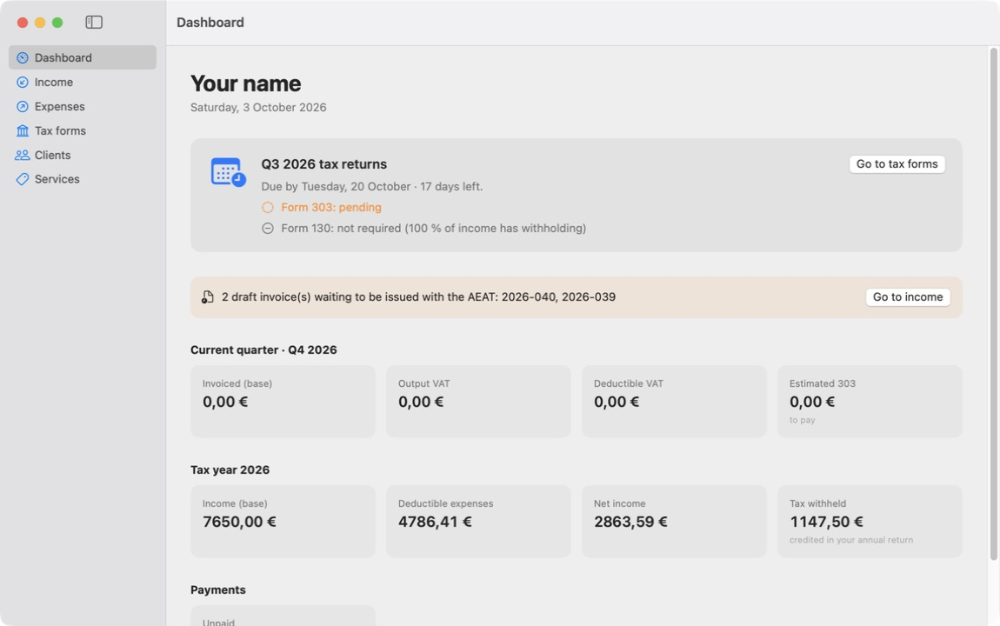
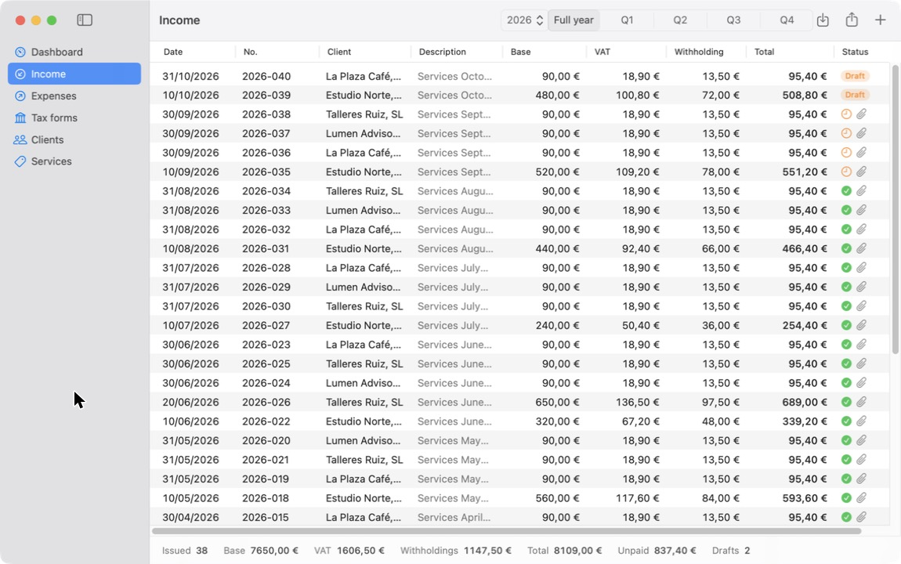
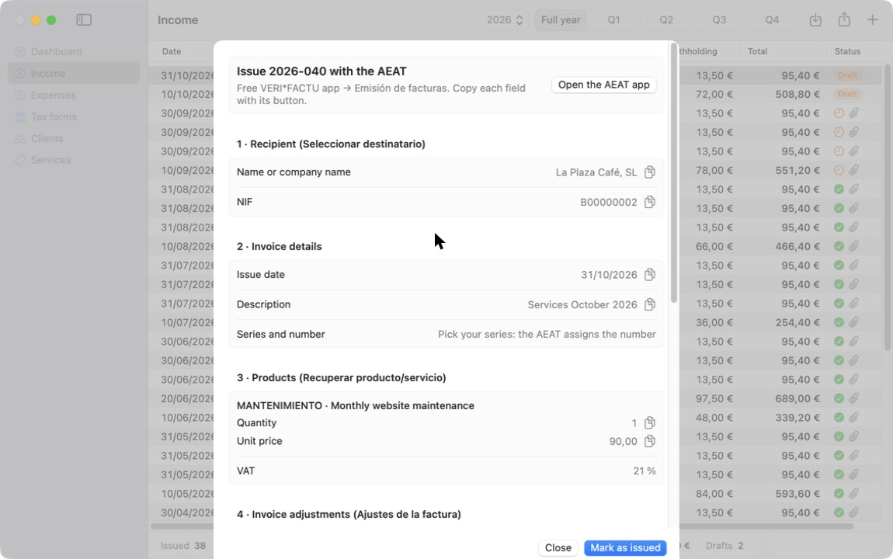
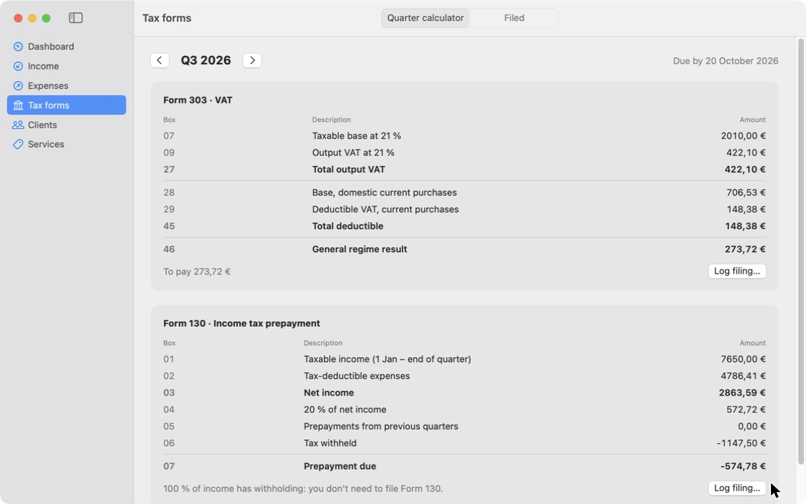
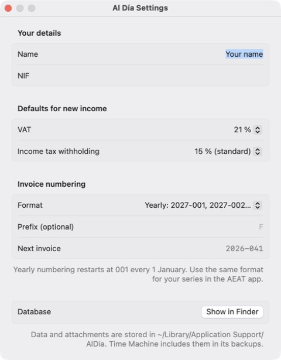

# Al Día

**Simple bookkeeping for Spanish *autónomos* — a native macOS app.**
Stay up to date with Hacienda: prepare invoices, log deductible expenses and get your quarterly tax forms (303 / 130) calculated, box by box.

[Leer en castellano](README.es.md) · macOS 15+ · Swift 6 · SwiftUI + SwiftData · [MIT](LICENSE)



## Who is it for?

Any self-employed person in Spain (*autónomo*) who wants to keep their numbers in order without paying for a full accounting suite. It is designed to stay simple whether you send one invoice a month or thirty, to one client or ten.

Until VeriFactu becomes mandatory, Al Día can **issue your invoices as PDF** and email them to your clients. It is **not** a VeriFactu system and sends nothing to the tax agency: once VeriFactu applies, you prepare the invoice in Al Día and issue it with the **free VERI\*FACTU app from the AEAT**; Al Día keeps track of it and does the tax maths around it.

## Features

- **Dashboard** with the next filing deadline, which forms are already filed, pending drafts and the quarter/year figures.
- **Income** — invoices with lines, VAT (IVA) and income tax withholding (IRPF), payment status and the PDF attached.
  - **Drafts** prepared in Al Día don't count for taxes until you mark them as issued.
  - **Issue with Al Día**: a clean A4 PDF with every legally required detail (issuer and client tax IDs and addresses, lines, VAT, withholding, total, IBAN, custom footer), archived in `~/Documents/Al Día/Facturas/<year>` and ready to **send by email** to the client from your mail app.
  - **Issue with the AEAT**: every field the AEAT app asks for, in the same order, with a copy button.
  - **PDF import** of invoices you already have (from a spreadsheet template), with a review step.
  - **Yearly numbering** (`2027-001`, `2027-002`…, optional prefix) that restarts every 1 January and is never repeated, however many invoices you issue a month.
- **Expenses** — deductible VAT and income-tax expense calculated per purchase, with sensible defaults per category (e.g. 50 % VAT for a mixed-use vehicle, no VAT for social security).
  - **Import a receipt or invoice** from its PDF or a photo (or drag it onto the list): supplier, tax ID, number, date, base, VAT and total are read with on-device text recognition (Apple Vision) and filled in for you to review. It also checks whether the invoice carries your NIF, i.e. whether its VAT is deductible.
- **Tax forms** — draft of **Form 303** (VAT) and **Form 130** (income tax prepayment) with box numbers; detects when 130 is not required (≥ 70 % of income with withholding); log what you filed with its receipt and carry negative VAT forward.
- **Clients and services** catalogue, exportable in the exact text format the AEAT app imports.
- **CSV export** of income and expense ledgers for your accountant (Spanish Excel format).
- **English and Spanish** interface (follows the macOS language).
- **Local and private**: everything stays on your Mac, no account. The only network request is optional: typing a postcode asks Apple's geocoder for the town (only the postcode is sent).
- **Smart fields**: province from the postcode, IBAN grouped in fours and checked (ISO 13616), recommended GDPR footer filled in with your details.

| Income | Issue with the AEAT | Tax forms | Settings |
|---|---|---|---|
|  |  |  |  |

## How it fits with VeriFactu

Every *autónomo* who invoices with software will have to use a VeriFactu-compliant system ([RD 1007/2023](https://www.boe.es/buscar/act.php?id=BOE-A-2023-24840)). The legal date is **1 July 2027** (RDL 15/2025); in October 2026 the government announced a further delay to **October 2028**, pending publication. Until then Al Día issues PDF invoices like any spreadsheet would; it warns you when an invoice date falls after the deadline (`VeriFactu.obligatorioDesde` in `FacturaPDF.swift`). Writing VeriFactu software makes you its legal "producer", so from then on Al Día deliberately stays on the safe side:

1. **Prepare** the invoice in Al Día (draft).
2. **Issue** it in the [free VERI\*FACTU app](https://sede.agenciatributaria.gob.es/Sede/procedimientoini/IZ86.shtml), copying the fields from the issue sheet.
3. **Mark it as issued** in Al Día with the official number and the PDF (with its QR code).

Before your first invoice, export your clients and services from Al Día and import them into the AEAT app (*Otros servicios → Clientes / Productos → Importar*), so issuing is just picking them.

## Install

There is no notarised download yet; build it from source (one command):

```bash
git clone https://github.com/juanitreque/al-dia.git
cd al-dia
scripts/build-app.sh --install
```

Requirements: macOS 15 or later and Xcode 16 or later (command line tools are enough to build; the Xcode toolchain is needed for SwiftData macros and the string catalog).

This puts **Al Día.app** in `/Applications`. The app is signed ad-hoc, so the first time macOS may say it cannot verify the developer: right-click the app → **Open** → **Open**.

## Your data

Everything is stored in `~/Library/Application Support/AlDia/` (a SwiftData/SQLite database plus attached PDFs) and is included in Time Machine backups. *Settings → Show in Finder* opens the folder. Nothing leaves your Mac.

## Development

```bash
swift test                        # fiscal logic tests (AlDiaCore)
swift run AlDia --demo            # run with a temporary database full of sample data
scripts/sync-strings.sh           # extract UI strings into packaging/Localizable.xcstrings
swift scripts/make-icon.swift     # regenerate the app icon
```

```
Sources/
  AlDiaCore/   pure logic: quarters, deadlines, Form 303/130, numbering, invoice and receipt readers, AEAT formats
  AlDia/       SwiftUI app: SwiftData models, views, demo data
Tests/         Swift Testing suites for AlDiaCore
packaging/     Info.plist, icon and Localizable.xcstrings (Spanish source, English translation)
scripts/       build, string sync and icon scripts
```

Spanish is the source language of the code and the string catalog; English lives in `packaging/Localizable.xcstrings` (editable in Xcode). Contributions are welcome — especially fixes to the tax logic, which should come with a test.

## Limitations

- Only the general VAT regime and *estimación directa* for income tax. No equivalence surcharge, simplified regime (*módulos*), intra-EU operations or depreciation schedules.
- Deadlines move to Monday when they fall on a weekend, but national/regional holidays are not considered.
- Reading receipts is a best effort: always review the amounts before saving. Handwritten or very blurry tickets may need typing.
- The PDF importer for *your own past invoices* understands one invoice layout (`Número: … Fecha: …` header and a `CONCEPTO / UNIDAD / PRECIO` table); other layouts need code changes.
- Amounts are always shown in Spanish format (1.234,56 €).

## Disclaimer

Al Día is a personal tool shared as is. It is not affiliated with the Agencia Tributaria and is **not tax advice**: figures are an aid to review, always check them against the official forms or with your accountant before filing.

## License

[MIT](LICENSE) © juanitreque
